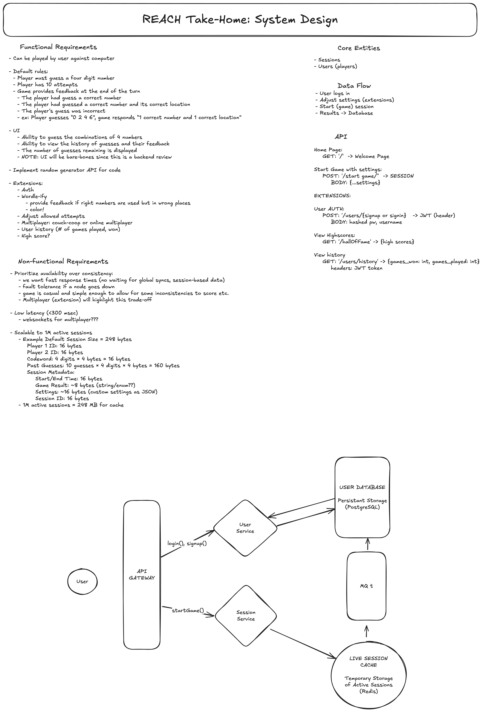

# Mastermind

## Docker instructions

Prerequisites:

- Docker and Docker Compose installed on your machine
- Git installed on your machine

### Development Environment

1. _Clone this repo:_ Open a Terminal and change the current working directory to where you'd like the cloned repository to be stored. Use following git command: `git clone https://github.com/conniedonahue/mastermind.git`.
2. _Enter the directory in your terminal:_ `cd mastermind`
3. _Start the Dev Server:_ `docker-compose up` Note:
4. _Access the Application:_ After running the `docker-compose` command, open up your browser to `http://localhost:5001`

5. _Access the User Databse:_

- through Docker's psql: `docker-compose exec db psql -U user -d dev_db`
- or through your local psql: `psql -h localhost -p 5432 -U user -d dev_db`

Some helpful Docker commands while using the app:

To close the docker server: `docker-compose down`
To view logs: `docker-compose logs`
To continously follow the logs: `docker-compose logs -f`
To see all Docker container-ids: `docker ps`
To create database backup: `docker-compose exec db pg_dump -U user dev_db > backup.sql`
To restore database: `docker-compose exec -T db psql -U user dev_db < backup.sql`

### Production Environment

In a real life deployment, I would ask you to create your own .env files by running these commands:

```
cp .env.development.example .env.development
cp .env.production.example .env.production
```

and then edit the files with the correct secret information. For ease of turnover for this project, I amd using dummy environmental variables in my docker-compose.prod.yml. It will load up a production server, but it won't connect you to my Heroku deployed server and postgress database (more on that below).

To access the production server, complete steps 1-2 above, and then:

1. _Start the Production Server:_ `docker-compose -f docker-compose.prod.yml up --build`
2. _Access the Application:_ After running the `docker-compose` command, open up your browser to `http://localhost:8000`
3. _Access the User Databse:_

- through Docker's psql: `docker-compose exec db psql -U user -d prod_db`
- or through your local psql: `psql -h localhost -p 5432 -U user -d prod_db`

### Troubleshooting:

- Port Conflicts

  - Make sure no other services are using ports 5001, 8000, or 5432
    - If they are, change the left side of the port mapping in the docker-compose.yml files. e.g. ports: "5001:5000" -> "5011:5000"
  - Stop local PostgreSQL if running: e.g. `brew services stop postgresql`

- Database Connection Issues
  - Verify the database container is running: docker-compose ps
  - Check database logs: docker-compose logs db
  - Ensure environment variables are correctly set

## Node instructions

To run this server locally using Node, do the following:

1. _Clone this repo:_ Grab the HTTPS URL from the main page of this repository and clicking the `<> Code` button. Open a Terminal and change the current working directory to where you'd like the cloned repository to be stored. Use following git command: `git clone https://github.com/conniedonahue/file-compare.git`.
2. _Open the project in an IDE:_ Find the cloned repo and open it in an IDE like VS Code.
3. _Run the server:_ Run `npm run start`.
4. _Test out the app:_ Try out some of the `curl` requests listed above.

## Design considerations

Here is an early sketch of the system design.


### Functional Requirements

- Can be played by user against computer
- Secret Code must be pulled from Random generator API
- Default rules:
  - Player must guess a four digit number (0-7)
  - Player has 10 Attempts
  - Game provides feedback at the end of the turn
    - number of correct numbers and number of correct positions
- User Interface:
  - Ability to guess the combinations of 4 numbers
  - Ability to view the history of guesses and their feedback
  - The number of guesses remaining is displayed
  - NOTE: UI will be bare-bones since this is a backend review

### Nonfunctional Requirements

- Prioritize availability over consistency:

  - we want fast response times (no waiting for global syncs, session-based data)
  - fault tolerance if a node goes down
  - game is casual and simple enough to allow for some inconsistencies to score etc.
  - Multiplayer (extension) will highlight this trade-off

- Low latency (<300 msec)

  - websockets for multiplayer???

- Scalable to 1M active sessions

  - Example Default Session Size = 248 bytes

    - Player 1 ID: 16 bytes
    - Player 2 ID: 16 bytes
    - Codeword: 4 digits × 4 bytes = 16 bytes
    - Past Guesses: 10 guesses × 4 digits × 4 bytes = 160 bytes

    Session Metadata:

    - Start/End Time: 16 bytes
      Game Result: ~8 bytes (string/enum??)
      Settings: ~16 bytes (custom settings as JSON)
      Session ID: 16 bytes

  - 1M active sessions = 248 MB for cache

### Core Entities

- Sessions
- Users (players)

### Data Flow

- User logs in
- Adjust settings (extensions)
- Start (game) session
- Results -> Database

### Express Backend

The backend is built in Node/Express using a controller pattern. Express has very handy mechanisms for error handling/JSON parsing, and it also has a rich ecosystem of libraries and middleware (like `express-rate-limit`).

### LRU Cache

In order to cut down on the compute time of parsing files, I thought it would be helpful to cache parsed files in an LRU cache. This would be helpful comparing the same file to multiple other files. Based on the calculations in the Nonfunctional Requirements section, 10% of expected traffic would come to 360GB... which would require a fleet of servers. It might be more realistic to bring this number down to 36GB (1% of total) and adjust strategy based on cache misses. For production, parsed content should be encrypted to prevent unauthorized access.

### User Database

Out of scope for this project was handling users and authentication. For production, I would build out a user database that included the history of response objects from past searches. These response objects could be used for faster retrievals of previously-entered comparisons.

## Production Readiness Checklist

### 🔒 Security

- [x] Error handling implemented in `server.js` middleware
- [x] Input validation for file uploads
- [x] File type restrictions in `parseController.js`
- [x] Implement rate limiting
- [ ] Add HTTPS support
- [ ] Add security headers

### 🚀 Performance

- [x] LRU Caching for file parsing (`parsedFileCache.js`)
  - Configured for 200K entries (100 comparisons) or 2.5MB max
  - 24-hour cache retention
- [x] Efficient file parsing with minimal memory overhead
- [ ] Add request logging / timing metrics

### 📊 Reliability

- [x] Comprehensive error handling
- [x] Detailed error responses in OpenAPI spec
- [x] Containerized with Docker
- [x] Graceful error routing in `server.js`
- [ ] Implement `/health` check endpoint

### 🧪 Testing

- [x] Unit tests for controllers
- [x] Integration tests for API endpoints
- [x] Error scenario testing
- [ ] Add performance/load testing
- [ ] Implement end-to-end testing
- [ ] Contract testing

### 📝 Documentation

- [x] OpenAPI specification
- [x] Detailed README
- [ ] Add performance and scaling recommendations

### 🔍 Observability

- [ ] Implement logging
- [ ] Add request tracing
- [ ] Configure application monitoring

### ⚙️ Configuration

- [x] Environment-based port configuration

### 🌟 Potential Features Roadmap

- [ ] User Authentication System
  - User registration
  - Secure login / OAuth etc.
- [ ] Results Persistence
  - Database to store comparison results
  - Allow users to view comparisons history
  - Export results (PDF/CSV)
- [ ] Advanced Comparison Options
  - Configurable comparison modes (strict/lenient)
  - Support for more file types
  - Support for non-English language
  - Detailed diff visualization
- [ ] Collaborative Features
  - Share comparison results
  - Add comments to differences
- [ ] Performance Enhancements
  - Async file processing
  - Batch file comparison
- [ ] Put LRU Cache in Distributed System

### Next Steps for Production Readiness

1. Add logging
2. Set up application monitoring
3. Configure HTTPS
4. Set up persistent database for Users / Results
5. Tackle non-English characters
